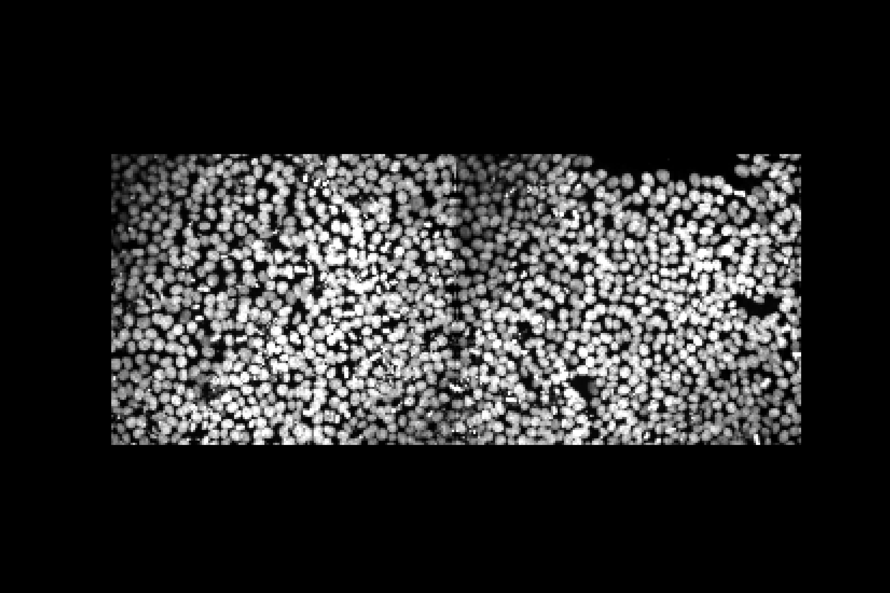
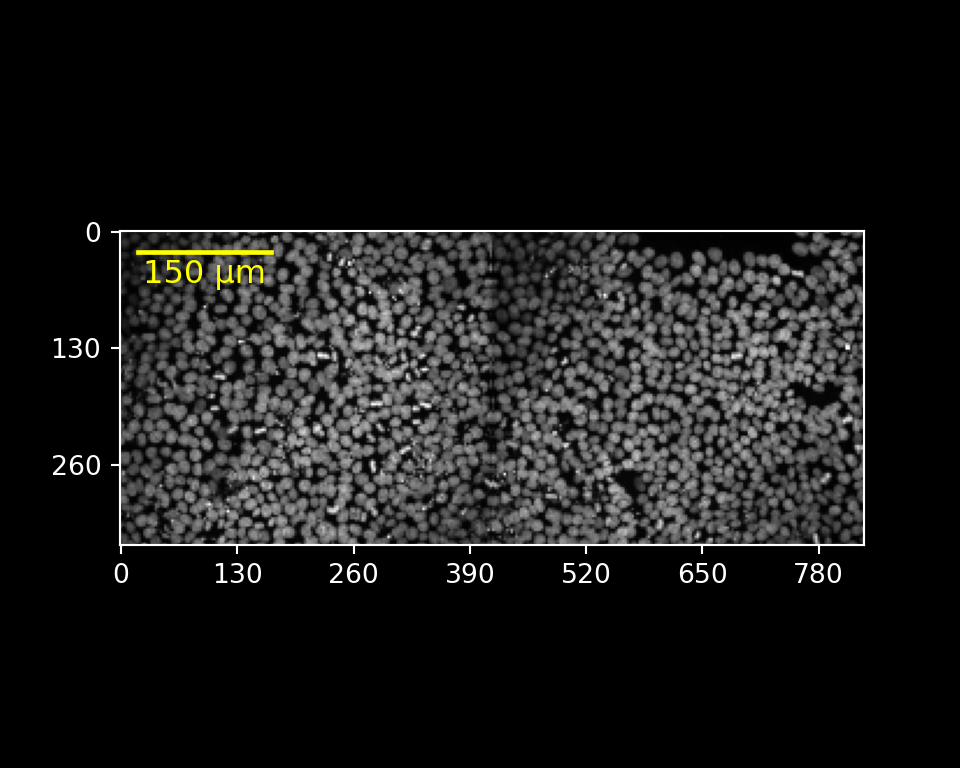
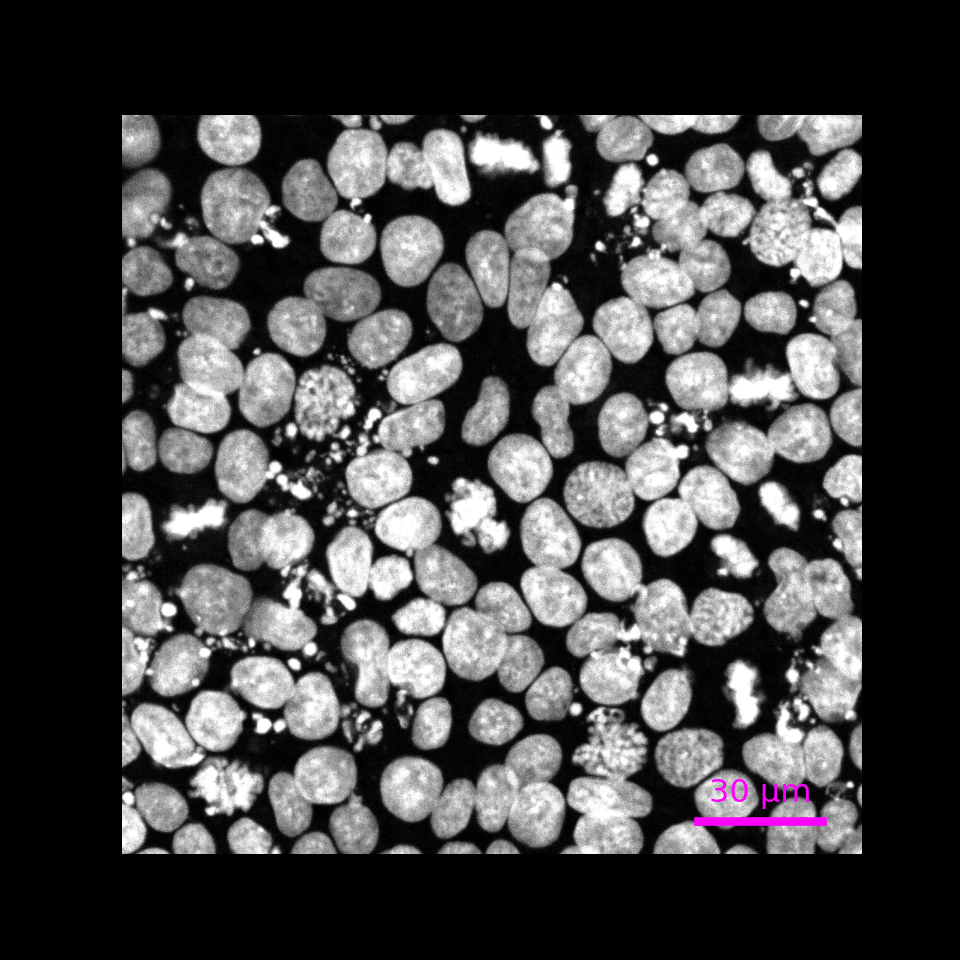
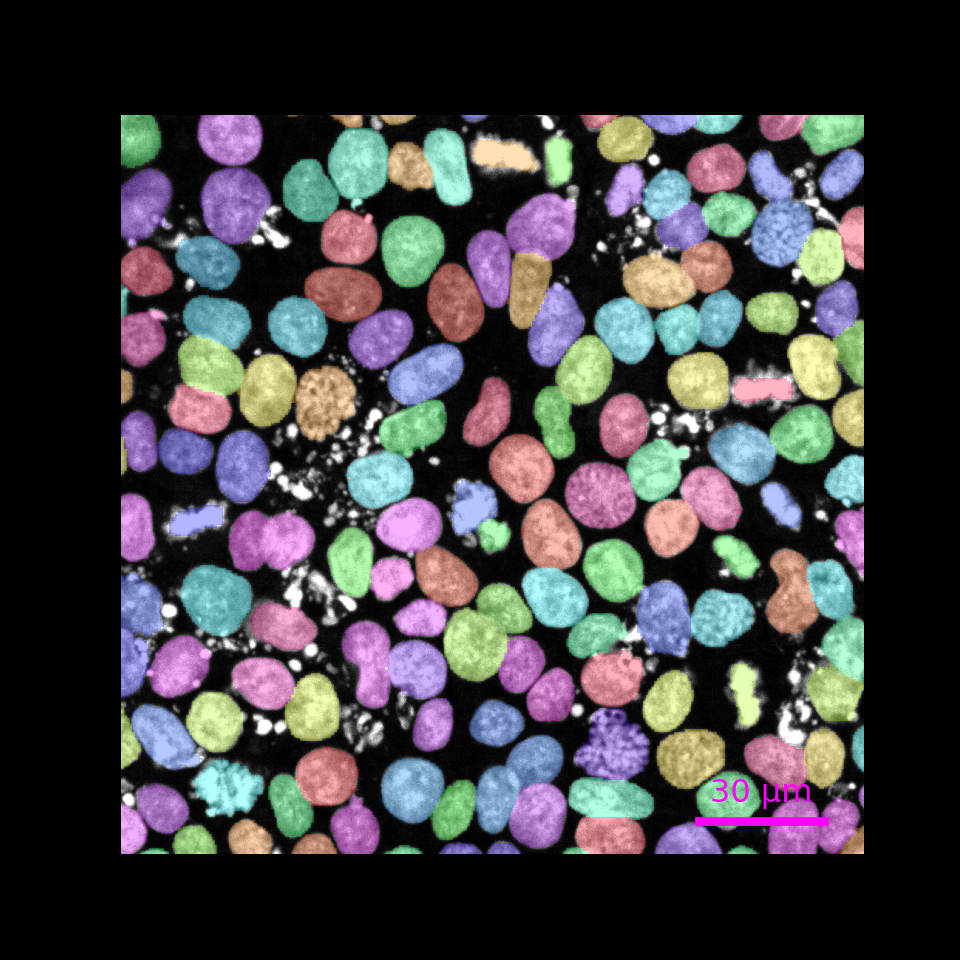
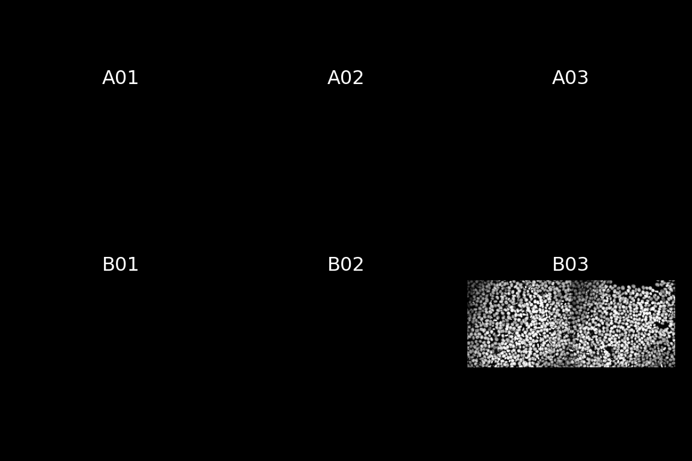
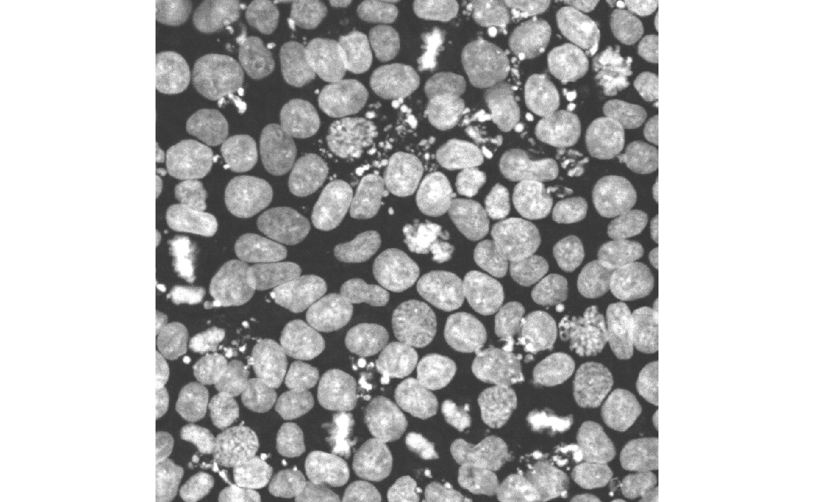

# Using ez-zarr in R

This vignette describes how to use the `ezzarr` R package, which
provides a thin R wrapper around the
[`ez-zarr`](https://pypi.org/project/ez-zarr/) python package. For a
full documentation of the functionality provided by `ez-zarr`, we refer
to the [website](https://fmicompbio.github.io/ez_zarr/).

`ezzarr` does not add any new functionality compared to the python
package, but provides an easy way to set up and activate a `conda`
environment with all necessary dependencies for `ez-zarr`, and once the
environment is activated in an R session, the `reticulate` package can
be used to access the functionality in `ez-zarr`, to import and interact
with image and plate objects from OME-Zarr files in R.

## Load the `ezzarr` package

``` r
library(ezzarr)
library(EBImage)
```

## Check the version of ez-zarr

The
[`getEzZarrVersion()`](https://fmicompbio.github.io/ezzarr/reference/getEzZarrVersion.md)
function returns the version of `ez-zarr` which will be installed and
used by the current version of `ezzarr`. Calling this function will also
build the `conda` environment if it does not already exist.

``` r
getEzZarrVersion()
#> [1] "0.4.2"
```

## Get the path to the environment

`ezzarr` provides a convenience function to get the path to the
`ez-zarr` `conda` environment. This can be useful e.g. in order to
activate the environment outside of R.

``` r
getEzZarrEnvPath()
#> [1] "/Users/runner/Library/Caches/org.R-project.R/R/basilisk/1.22.0/ezzarr/0.1.9/ezzarr"
```

## Download example data to temporary directory

In the remainder of this vignette, we will illustrate the use of
`ezzarr` by means of an example data set, representing a maximum
intensity projection of one well from a high-content screening plate,
processed using
[Fractal](https://fractal-analytics-platform.github.io/). The same data
set is used in the `ez-zarr` [python
documentation](https://fmicompbio.github.io/ez_zarr/getting_started_Image/).
The data is available on Zenodo; here, we download and unpack it to a
temporary directory.

``` r
td <- tempdir()
url <- "https://zenodo.org/records/10519143/files/20200812-CardiomyocyteDifferentiation14-Cycle1_mip.zarr.zip"
download.file(url, destfile = file.path(td, basename(url)))
unzip(file.path(td, basename(url)), 
      exdir = td)
```

Before going further, we save the path to the unpacked data set in the
`zarrpath` variable, and explore the content of the directory.

``` r
zarrpath <- file.path(td, sub("\\.zip$", "", basename(url)))
fs::dir_tree(zarrpath, recurse = 3)
#> /var/folders/6c/pzd640_546q6_yfn24r65c_40000gn/T//RtmpIVp6zJ/20200812-CardiomyocyteDifferentiation14-Cycle1_mip.zarr
#> └── B
#>     └── 03
#>         └── 0
#>             ├── 0
#>             ├── 1
#>             ├── 2
#>             ├── 3
#>             ├── 4
#>             ├── labels
#>             └── tables
```

## Activate the environment

Next, we activate the `conda` environment that contains `ez-zarr` and
all necessary dependencies, via the
[`enableEzZarr()`](https://fmicompbio.github.io/ezzarr/reference/enableEzZarr.md)
function. In addition to activating the `conda` environment, this
function returns a list of imported python modules, which can be used to
access python functions.

``` r
## Activate environment
env <- enableEzZarr()

## List imported modules
names(env)
#> [1] "plt"     "np"      "ez_zarr"

## Switch matplotlib backend (for non-interactive use)
env$plt$switch_backend("agg")
```

## Load an example image

Now that the environment is activated, we can import an image from an
OME-Zarr fileset. We do this by creating an object of the
[`Image`](https://fmicompbio.github.io/ez_zarr/ome_zarr/#src.ez_zarr.ome_zarr.Image)
class, defined in `ez-zarr`.

``` r
## Capture the output from python since user warnings from Zarr may 
## otherwise stall the vignette building (when run non-interactively).
res <- reticulate::py_capture_output({
    img <- env$ez_zarr$ome_zarr$Image(path = file.path(zarrpath, "B/03/0"))
})

img
#> Image 0
#>   path: /var/folders/6c/pzd640_546q6_yfn24r65c_40000gn/T//RtmpIVp6zJ/20200812-CardiomyocyteDifferentiation14-Cycle1_mip.zarr/B/03/0
#>   n_channels: 1 (DAPI)
#>   n_pyramid_levels: 5
#>   pyramid_zyx_scalefactor: [1. 2. 2.]
#>   full_resolution_zyx_spacing (micrometer): [1.0, 0.1625, 0.1625]
#>   segmentations: empty, nuclei
#>   tables (measurements): nuclei_ROI_table, expected_table_FOV_ROI_table_1_True_0_0, expected_table_well_ROI_table_3_True_0_0, expected_table_well_ROI_table_3_False_0_0, expected_table_masked_nuclei_ROI_table_0_True_0_0, expected_table_FOV_ROI_table_1_False_0_0, expected_table_masked_nuclei_ROI_table_1_True_0_0, FOV_ROI_table, nuclei, well_ROI_table, expected_table_well_ROI_table_0_True_0_0

img$tree(level = 1)
#> /
#> ├── 0 (1, 1, 2160, 5120) uint16
#> ├── 1 (1, 1, 1080, 2560) uint16
#> ├── 2 (1, 1, 540, 1280) uint16
#> ├── 3 (1, 1, 270, 640) uint16
#> ├── 4 (1, 1, 135, 320) uint16
#> ├── labels
#> │   ├── empty
#> │   └── nuclei
#> └── tables
#>     ├── FOV_ROI_table
#>     ├── expected_table_FOV_ROI_table_1_False_0_0
#>     ├── expected_table_FOV_ROI_table_1_True_0_0
#>     ├── expected_table_masked_nuclei_ROI_table_0_True_0_0
#>     ├── expected_table_masked_nuclei_ROI_table_1_True_0_0
#>     ├── expected_table_well_ROI_table_0_True_0_0
#>     ├── expected_table_well_ROI_table_3_False_0_0
#>     ├── expected_table_well_ROI_table_3_True_0_0
#>     ├── nuclei
#>     ├── nuclei_ROI_table
#>     └── well_ROI_table
```

## Get details about the image

`ez-zarr` contains many
[methods](https://fmicompbio.github.io/ez_zarr/ome_zarr/#src.ez_zarr.ome_zarr.Image)
for accessing various aspects of an `Image` object. Here, we illustrate
some of these.

``` r
## Channel information
length(img$nchannels_image)
#> [1] 1
img$channels[[1]]
#> $color
#> [1] "00FFFF"
#> 
#> $label
#> [1] "DAPI"
#> 
#> $wavelength_id
#> [1] "A01_C01"
#> 
#> $window
#> $window$end
#> [1] 800
#> 
#> $window$max
#> [1] 65535
#> 
#> $window$min
#> [1] 0
#> 
#> $window$start
#> [1] 110

## Label names
img$label_names
#> [1] "empty"  "nuclei"

## Scales for a given pyramid level
unlist(img$get_scale(pyramid_level = "2"))
#> [1] 1.00 1.00 0.65 0.65

## Path
img$get_path()
#> [1] "/var/folders/6c/pzd640_546q6_yfn24r65c_40000gn/T//RtmpIVp6zJ/20200812-CardiomyocyteDifferentiation14-Cycle1_mip.zarr/B/03/0"

## Image name
img$name
#> [1] "0"

## Table names
img$table_names
#>  [1] "nuclei_ROI_table"                                 
#>  [2] "expected_table_FOV_ROI_table_1_True_0_0"          
#>  [3] "expected_table_well_ROI_table_3_True_0_0"         
#>  [4] "expected_table_well_ROI_table_3_False_0_0"        
#>  [5] "expected_table_masked_nuclei_ROI_table_0_True_0_0"
#>  [6] "expected_table_FOV_ROI_table_1_False_0_0"         
#>  [7] "expected_table_masked_nuclei_ROI_table_1_True_0_0"
#>  [8] "FOV_ROI_table"                                    
#>  [9] "nuclei"                                           
#> [10] "well_ROI_table"                                   
#> [11] "expected_table_well_ROI_table_0_True_0_0"
```

## Plot image

Plots in `ez-zarr` are implemented using `matplotlib.pyplot` and display
correctly when using the plot methods interactively from python
(e.g. `img.plot()`) or from R via `reticulate` (e.g. `img$plot()`). A
special case is the use of plot methods in non-interactive Rmarkdown or
Quarto documents. In these, the plots are only shown for `python` code
chunks, which is used in the examples below (note the `r.img` syntax to
refer to the `img` object in the R process).

### With default settings

``` python
r.img.plot()
```



The corresponding R code (for interactive use) would look like:

``` r
img$plot()
```

### Adding a scale bar, limiting the channel range

``` python
r.img.plot(channels = [0],
           channel_colors = ["white"],
           channel_ranges = [[100, 600]],
           scalebar_micrometer = 150,
           scalebar_color = "yellow",
           scalebar_position = "topleft",
           scalebar_label = True,
           fig_width_inch = 5,
           fig_height_inch = 4,
           fig_dpi = 100,
           axis_style = "micrometer")
```



The corresponding R code for interactive is shown below. Please note
that you need to use specific R data structures to satisfy the expected
arguments types of the python function. For example, a python list
(`[...]`) has to be created using an R list (`list(...)`) and not a
vector. For a list of the conversions that reticulate uses between R and
python data structures see [reticulate type
conversions](https://rstudio.github.io/reticulate/articles/calling_python.html#type-conversions).

``` r
img$plot(channels = list(0L),
         channel_colors = list("white"),
         channel_ranges = list(c(100, 600)),
         scalebar_micrometer = 150L,
         scalebar_color = "yellow",
         scalebar_position = "topleft",
         scalebar_label = TRUE,
         fig_width_inch = 5,
         fig_height_inch = 4,
         fig_dpi = 100,
         axis_style = "micrometer")
```

### Zoom in

``` python
r.img.plot(pyramid_level = "0",
           upper_left_yx = [130, 140],
           lower_right_yx = [300, 310],
           scalebar_micrometer = 30,
           scalebar_color = "magenta",
           fig_width_inch = 5,
           fig_height_inch = 5,
           fig_dpi = 100)
```



### Overlay nuclei segmentation

``` python
r.img.plot(label_name = "nuclei", 
           pyramid_level = "0",
           upper_left_yx = [130, 140],
           lower_right_yx = [300, 310],
           scalebar_micrometer = 30,
           scalebar_color = "magenta",
           fig_width_inch = 5,
           fig_height_inch = 5,
           fig_dpi = 100)
#> /Users/runner/Library/Caches/org.R-project.R/R/basilisk/1.22.0/ezzarr/0.1.9/ezzarr/lib/python3.12/site-packages/ez_zarr/ome_zarr.py:944: UserWarning: For the requested pyramid level (0) of the intensity image, no matching label ('nuclei') is available. Up-scaling the label using factor(s) [1. 4. 4.]
#>   warnings.warn(f"For the requested pyramid level ({pyramid_level}) of the intensity image, no matching label ('{lname}') is available. Up-scaling the label using factor(s) {scalefact_yx}")
```



## Import and plot entire plate

Above, we imported and visualized a single image. `ez-zarr` also
contains classes to represent high-content screening plates or other,
arbitrary, collections of images. Here, we use the `import_plate()`
function to read the whole plate (note that only one well was imaged).

``` r
res <- reticulate::py_capture_output({
    plt <- env$ez_zarr$ome_zarr$import_plate(zarrpath)
})
```

Again, we use a python code chunk for the plot to be included in our
compiled notebook (not needed for interactive use):

``` python
r.plt.plot()
```



## Extract subarray

In addition to plotting, `ez-zarr` also contains functionality to
extract subarrays of a given image, based on coordinates (given either
in pixel space for a given pyramid level, or in micrometers). Here we
illustrate this by extracting a subarray defined by a bounding box in
the x/y plane (the same area that we zoomed in to above), and displaying
the resulting array with the `EBImage` R package.

``` r
out <- img$get_array_by_coordinate(upper_left_yx = c(130, 140), 
                                   lower_right_yx = c(300, 310), 
                                   pyramid_level = "0", 
                                   as_NumPy = TRUE, 
                                   coordinate_unit = "micrometer")

## Output is an R array
class(out)
#> [1] "array"
dim(out)
#> [1]    1    1 1046 1046

## Display 2d image
im <- EBImage::Image(out[1, 1, , ] / 500)
EBImage::display(im, method = "raster", interpolate = FALSE)
```



It is also possible to extract a pair of arrays (from the intensity
image and one or more of the provided labels).

``` r
pair <- img$get_array_pair_by_coordinate(label_name = "nuclei", 
                                         upper_left_yx = c(130, 140),
                                         lower_right_yx = c(300, 310),
                                         pyramid_level = "0",
                                         coordinate_unit = "micrometer")

length(pair)
#> [1] 2

## Intensity image
dim(pair[[1]])
#> [1]    1    1 1044 1048

## Label(s)
length(pair[[2]])
#> [1] 1
dim(pair[[2]][[1]])
#> [1]    1 1044 1048
```

## Session info

``` r
sessionInfo()
#> R version 4.5.2 (2025-10-31)
#> Platform: aarch64-apple-darwin20
#> Running under: macOS Sequoia 15.7.1
#> 
#> Matrix products: default
#> BLAS:   /System/Library/Frameworks/Accelerate.framework/Versions/A/Frameworks/vecLib.framework/Versions/A/libBLAS.dylib 
#> LAPACK: /Library/Frameworks/R.framework/Versions/4.5-arm64/Resources/lib/libRlapack.dylib;  LAPACK version 3.12.1
#> 
#> locale:
#> [1] en_US.UTF-8/en_US.UTF-8/en_US.UTF-8/C/en_US.UTF-8/en_US.UTF-8
#> 
#> time zone: UTC
#> tzcode source: internal
#> 
#> attached base packages:
#> [1] stats     graphics  grDevices utils     datasets  methods   base     
#> 
#> other attached packages:
#> [1] EBImage_4.52.0 ezzarr_0.1.9  
#> 
#> loaded via a namespace (and not attached):
#>  [1] Matrix_1.7-4        jsonlite_2.0.0      crayon_1.5.3       
#>  [4] compiler_4.5.2      filelock_1.0.3      Rcpp_1.1.0         
#>  [7] bitops_1.0-9        parallel_4.5.2      jquerylib_0.1.4    
#> [10] systemfonts_1.3.1   textshaping_1.0.4   png_0.1-8          
#> [13] yaml_2.3.10         fastmap_1.2.0       reticulate_1.44.0  
#> [16] lattice_0.22-7      R6_2.6.1            generics_0.1.4     
#> [19] knitr_1.50          BiocGenerics_0.56.0 htmlwidgets_1.6.4  
#> [22] tibble_3.3.0        desc_1.4.3          fftwtools_0.9-11   
#> [25] pillar_1.11.1       bslib_0.9.0         tiff_0.1-12        
#> [28] rlang_1.1.6         cachem_1.1.0        dir.expiry_1.18.0  
#> [31] xfun_0.54           fs_1.6.6            sass_0.4.10        
#> [34] cli_3.6.5           magrittr_2.0.4      pkgdown_2.2.0.9000 
#> [37] digest_0.6.38       grid_4.5.2          locfit_1.5-9.12    
#> [40] basilisk_1.22.0     lifecycle_1.0.4     vctrs_0.6.5        
#> [43] glue_1.8.0          evaluate_1.0.5      ragg_1.5.0         
#> [46] RCurl_1.98-1.17     abind_1.4-8         rmarkdown_2.30     
#> [49] pkgconfig_2.0.3     tools_4.5.2         jpeg_0.1-11        
#> [52] htmltools_0.5.8.1
```
